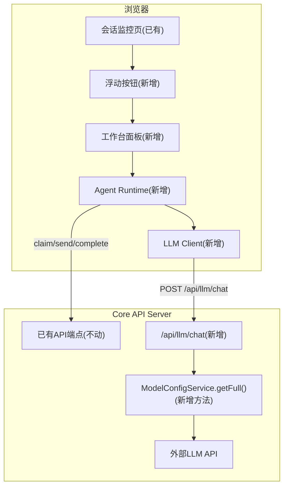

## 产品概述

在现有 Web Dashboard 会话监控页面中嵌入「工作台」面板，让用户通过网页配置模型+角色+Skill，生成网页Agent并在浏览器中运行自闭环循环，无需依赖AI IDE即可完成纯内容型工作。

## 核心功能

- **工作台面板**：右下角浮动按钮触发，右侧滑入面板，不遮挡左侧监控内容
- **Agent卡片网格**：多个Agent以缩略卡片同屏展示状态（运行中/空闲/异常），点击展开完整面板
- **添加Agent对话框**：选择模型、角色、Agent Profile、Skills后加入当前会话
- **Agent对话区**：用户可直接给Agent发消息（走现有消息通道），支持Markdown渲染
- **Agent Runtime引擎**：浏览器内运行，Worker/Keeper走claim→process→submit循环，Host走judge→dispatch→resolve循环
- **LLM代理端点**：后端新增/api/llm/chat，API Key不暴露到浏览器
- **Session绑定**：Agent自动绑定当前选中会话，切换会话时停止所有Agent

## 技术栈

- 后端：Fastify + TypeScript（现有架构）
- 前端：React 19 + TypeScript + Zustand + Vite（现有架构）
- 通信：REST API + WebSocket（现有架构）
- 类型：@ai-collab/protocol（现有Zod schema）

## 实现方案

### 架构设计

采用渐进增强模式，在现有会话监控页面上叠加工作台功能。后端仅新增一个LLM代理端点，前端新增Agent Runtime引擎和工作台UI组件。



### 实现要点

**1. 后端LLM代理端点（唯一核心后端变更）**

- 新增`POST /api/llm/chat`端点，接收`{modelConfigId, messages}`
- 通过`ModelConfigService.getFull()`获取完整apiKey（当前`get()`已脱敏）
- 参考现有`test()`方法中fetch LLM API的模式，支持streaming响应
- `getFull()`方法内部直接调用`repository.findById()`，返回含`apiKeyEncrypted`的完整配置

**2. 浏览器侧Agent Runtime**

- 基类`AgentRuntime`封装公共逻辑：Skill加载、Prompt构造、消息收发、心跳
- `WorkerRuntime`：claim→process(LLM)→submit循环，WebSocket驱动等待下一轮
- `HostRuntime`：judge(知识库判断)→dispatch(派发)→await(等待Worker回报)→resolve循环
- `KeeperRuntime`：继承WorkerRuntime，增加知识库特定操作（judge/fulfil/upsert）
- LLM调用全部通过`/api/llm/chat`代理，浏览器侧不接触apiKey

**3. 工作台UI**

- 浮动按钮：fixed定位在页面右下角，点击切换面板
- 滑入面板：fixed定位右侧，默认420px宽，带遮罩层
- 缩略卡片：2列Grid布局，显示角色、模型、状态灯、一行摘要
- 展开面板：对话区（消息列表+输入框）+ 状态面板（配置信息+运行指标）
- 添加对话框：选择Model→Role→AgentProfile→Skills→加入会话

**4. 用户与Agent对话**

- 用户消息走`POST /api/messages/send`，type为"instruction"
- fromAgentId使用当前会话的hostAgentId
- 消息进入会话历史，其他Agent可见

### 性能与可靠性

- Agent Runtime循环采用指数退避轮询（空闲时2s/4s/8s，收到消息后立即响应）
- LLM请求设置超时（复用ModelConfig.timeoutSeconds）
- 每个Agent独立运行时实例，互不干扰
- WebSocket断连时降级为轮询

## 目录结构

```
apps/core/src/
  ├── server/
  │   └── create-server.ts          # [MODIFY] 新增 POST /api/llm/chat 端点
  └── services/
      └── model-config-service.ts   # [MODIFY] 新增 getFull() 方法

packages/sdk/src/
  └── index.ts                      # [MODIFY] 新增 llmChat() 方法

apps/web/src/
  ├── agent/                        # [NEW] Agent Runtime 目录
  │   ├── types.ts                  # 类型定义：AgentConfig, AgentWindowState, LlmMessage, LlmResponse, ChatMessage
  │   ├── llm-client.ts             # 通过 /api/llm/chat 代理调用LLM
  │   ├── skill-loader.ts           # 通过 /api/skills/:id 加载Skill内容
  │   ├── agent-runtime.ts          # 基类：公共逻辑(Prompt构造/消息收发/心跳/状态回调)
  │   ├── worker-runtime.ts         # Worker循环：claim→process→submit
  │   ├── host-runtime.ts           # Host循环：judge→dispatch→await→resolve
  │   └── keeper-runtime.ts         # Keeper循环：继承Worker，增加知识库操作
  ├── state/
  │   └── workbench-store.ts        # [NEW] Zustand store：agents/selectedAgentId/panelOpen
  ├── hooks/
  │   └── use-workbench.ts          # [NEW] Hook：整合Store与Runtime逻辑
  ├── components/
  │   └── workbench/                # [NEW] 工作台UI组件目录
  │       ├── index.ts              # 导出
  │       ├── WorkbenchFloatingButton.tsx  # 右下角浮动触发按钮
  │       ├── WorkbenchSlidePanel.tsx      # 右侧滑入面板容器(含遮罩)
  │       ├── AgentCardGrid.tsx            # 缩略卡片网格(2列Grid)
  │       ├── AgentCard.tsx                # 单个缩略卡片(状态灯+摘要)
  │       ├── AgentDetailPanel.tsx         # 展开面板(组合对话+状态)
  │       ├── AgentChatArea.tsx            # 对话消息区(消息列表+输入框)
  │       ├── AgentStatusPanel.tsx         # 状态面板(配置+运行指标)
  │       └── AddAgentDialog.tsx           # 添加Agent配置对话框
  ├── lib/
  │   └── api-client.ts            # [MODIFY] 新增 llm.chat() 方法
  ├── i18n/
  │   ├── zh.ts                     # [MODIFY] 新增工作台翻译键
  │   └── en.ts                     # [MODIFY] 新增工作台翻译键
  └── pages/
      └── sessions/
          └── index.tsx             # [MODIFY] 嵌入浮动按钮+面板
```

## 设计风格

采用深色科技风（Noir Terminal），与现有管理后台保持一致。工作台面板使用深色半透明玻璃拟态效果，卡片使用微光边框和状态色指示灯，营造AI控制台的专业感。

## 页面布局

### 会话监控页+工作台面板（核心页面）

页面右下角浮动按钮，点击后右侧滑入工作台面板，不遮挡左侧现有监控内容。

**浮动按钮**：圆形按钮，深色背景+发光边框，hover时发光增强，显示工作台图标+运行中Agent数量badge。

**工作台面板**：

- 顶部：标题栏"工作台"+ 关闭按钮 + 当前Session名称
- 中上部：Agent缩略卡片网格（2列），每张卡片约120x80px，显示角色图标、名称、模型名、状态指示灯、一行摘要。点击选中展开。
- 中下部：选中Agent的展开面板，左右分栏——左侧对话区（消息气泡+输入框），右侧状态面板（模型信息、Skill列表、运行指标）
- 底部：「+ 添加Agent」按钮

**添加Agent对话框**：使用现有Modal组件，表单布局——角色选择、名称输入、模型下拉、Agent Profile下拉、Skills多选、System Prompt预览。

## SubAgent

- **code-explorer**
- Purpose: 在实现过程中探索现有代码模式（如WebSocket消息处理、心跳机制、Skill加载流程）
- Expected outcome: 确保Agent Runtime正确复用现有API调用模式和消息协议